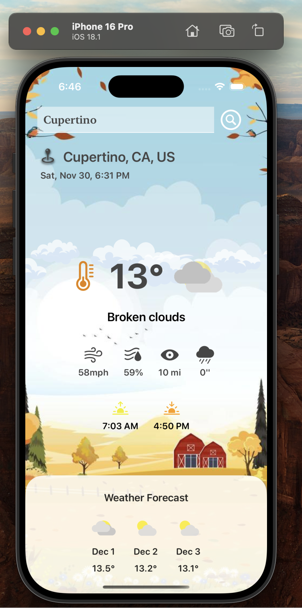
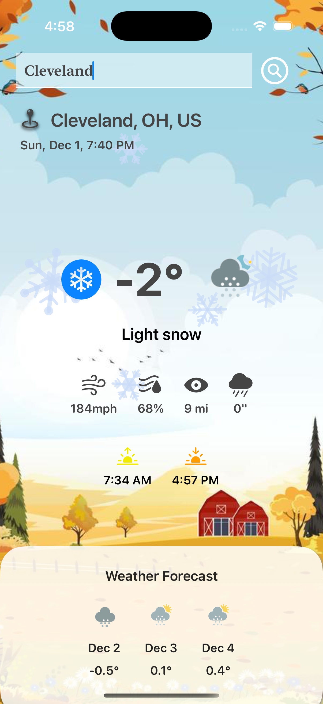

# Weather Forecast App 🌤️

A beautifully designed weather app built using **SwiftUI** that provides real-time weather updates, forecasts, and detailed weather metrics.


Demo: 
https://rupaljain97.github.io/assets/documents/projects/software_dev/Weather%20Forecast.mp4
---

## Features 🚀

- **Real-Time Weather**: Fetches current weather conditions, including temperature, wind speed, and humidity.
- **3-Day Weather Forecast**: Displays a detailed forecast for the next 3 days.
- **Dynamic UI**: 
  - Adjusts the app's color scheme based on the weather conditions.
  - Interactive and visually appealing animations powered by Lottie.
- **Localized Time & Units**: 
  - Converts universal time to the user's local timezone.
  - Supports unit conversion for wind speed, precipitation, and distance.
- **Responsive Design**: Fully optimized for all screen sizes.

---

## Technology and Structures

This Weather App was developed to explore and implement various iOS technologies and patterns, including:

- **Swift MVVM (Model-View-ViewModel):** Followed the MVVM architecture to separate the UI layer (View) from business logic (ViewModel), promoting cleaner and more testable code.
- **URLSession**: Used for handling network data transfer tasks to fetch real-time weather data and 3-day forecasts.
- **RESTful API**: Integrated the Weatherbit API to fetch detailed weather information for over 376,000 cities.
<!-- - **Core Animation**: Implemented smooth and interactive animations for enhanced user experience. -->
<!-- - **Auto Layout**: Utilized SwiftUI's layout tools for responsive and adaptive design. -->
- **Lottie**: Incorporated engaging animations using the Lottie framework to enhance visual appeal.
- **Web Services**: Handled data flow between the app and the Weatherbit API.

---

## Screenshots 📸

<!-- | **Current Weather** | **Weekly Forecast** | **Detailed Metrics** | -->
<!-- |----------------------|---------------------|-----------------------| -->
<!-- |  |  |  | -->

 


 |


---

## Installation 🛠️

1. **Clone the repository**:
    ```bash
    git clone https://github.com/your-username/weather-forecast-app.git
    cd weather-forecast-app
    ```
2. **Install dependencies**:
    Ensure you have the latest version of Xcode installed.
3. **Open the project**:
    Open the `WeatherForecast.xcodeproj` file in Xcode.
4. **Build and run**:
    Select a simulator or your connected device and click `Run` (⌘R).

---

## How It Works ⚙️

### API Integration
- The app fetches weather data from [Weatherbit.io](https://www.weatherbit.io/) using the following endpoints:
  - **Current Weather API**: Fetches the current weather data.
  - **3-Day Forecast API**: Fetches the weather forecast for the next week.

### Data Parsing
- Weather data is fetched in JSON format and decoded using `Codable` structs.
- All data is managed via a `WeatherViewModel` using the `@Published` property wrapper for real-time updates.

### Dynamic UI
- Weather conditions dynamically influence:
  - Background animations (using Lottie).
  - Icons for weather conditions (fetched from Weatherbit's API).
  - Temperature and weather descriptions.

---

## Configuration ⚡

1. **API Key**:
   - Sign up on [Weatherbit.io](https://www.weatherbit.io/) to get your API key.
   - Add your API key to `WeatherViewModel`:
     ```swift
     let apiKey = "your-weatherbit-api-key"
     ```

2. **Icons and Animations**:
   - Weather icons are fetched from Weatherbit's static assets.
   - Animations are integrated using Lottie.

---

<!-- ## To-Do List 📝

- [ ] Add hourly weather forecast.
- [ ] Improve accessibility for voiceover users.
- [ ] Enhance error handling for API failures.
- [ ] Support dark mode customization. -->


## Contact 📬

If you have any questions or suggestions, feel free to reach out:

- **Author**: Rupal Jain
- **Email**: jainrupal@arizona.edu
- **GitHub**: [@RupalJain97](https://github.com/RupalJain97)
