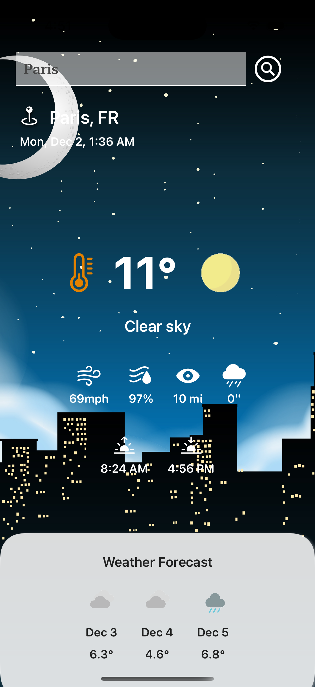

# Weather Forecast App 🌤️

A beautifully designed weather app built using **SwiftUI** that provides real-time weather updates, accurate 3-day forecasts, and dynamic animations tailored for over 376,000 cities worldwide.


[Full Video here:](https://rupaljain97.github.io/assets/documents/projects/software_dev/Weather%20Forecast.mp4)

https://github.com/user-attachments/assets/4958f483-9bd7-4ff4-bb0b-dd183e2e2452

---


## Features 🚀

- **Real-Time Weather Updates**: Displays current weather metrics including temperature, humidity, wind speed, and visibility.
- **3-Day Weather Forecast**: Displays a detailed forecast for the next 3 days.
- **Dynamic UI**: 
  - State-dependent UI components for day/night cycles and weather conditions.
  - Interactive and visually appealing animations powered by `Lottie-ios`.
- **Localized Time & Units**: 
  - Converts universal time to the user's local timezone.
  <!-- - Supports unit conversion for wind speed, precipitation, and distance. -->
- **Responsive Design**: Fully optimized for all screen sizes.
- **Engaging Animations:** Adds life to the app with tailored animations matching weather conditions.

<!-- - **Error Handling & Resilience:**
  * Displays user-friendly messages for invalid city names or API issues.
  * Handles network errors gracefully. -->

---

## Technology and Structures

This Weather App was developed to explore and implement various iOS technologies and patterns:

- **Swift and SwiftUI:**
  * Designed using **MVVM (Model-View-ViewModel)** to separate the UI layer (View) from business logic (ViewModel), promoting cleaner and more testable code.
  * Leveraged `@Published` and `ObservableObject` for real-time UI updates.

- **Network Integration:**
  * Utilized **URLSession** for handling network data transfer tasks to fetch real-time weather data and 3-day forecasts.

- **JSON Parsing with Codable:**
  * Efficiently parsed complex **JSON** responses using Swift's **Codable** protocol.

- **RESTful API**: 
  * Integrated the Weatherbit API to fetch detailed weather information for over 376,000 cities.

<!-- - **Auto Layout**: Utilized SwiftUI's layout tools for responsive and adaptive design. -->
- **Dynamic Animations with Lottie:**:    
  * Incorporated engaging animations using the Lottie framework to enhance visual appeal.

- **Data Localization:**
  * Dynamic timezone adjustments using Foundation.Date and TimeZone APIs.


---

## Screenshots 📸

<!-- | **Current Weather** | **Weekly Forecast** | **Detailed Metrics** | -->
<!-- |----------------------|---------------------|-----------------------| -->
<!-- |  |  |  | -->

<!--   -->

<!--  -->

<p style="dislay: flex; gap: 20px;">
  
  
</p>

<!--  -->


---

## Installation Guide 🛠️

1. **Clone the repository**:
    ```bash
    git clone https://github.com/your-username/weather-forecast-app.git
    cd weather-forecast-app
    ```
2. **Install dependencies**:
    Ensure you have the latest version of Xcode installed.
3. **Open the project**:
    Open the `WeatherForecast.xcodeproj` file in Xcode.

4. **Set Up API Key**:
    Sign up on [Weatherbit.io](https://www.weatherbit.io/) to get your API key.
   - Add your API key to `WeatherViewModel`:
     ```swift
     let apiKey = "your-weatherbit-api-key"
     ```
4. **Build and run**:
    Select a simulator or your connected device and click `Run` (⌘R).

---

## How It Works ⚙️

### API Integration
- The app fetches weather data from [Weatherbit.io](https://www.weatherbit.io/) using the following endpoints:
  - **Current Weather API**: Fetches the current weather data.
  - **3-Day Forecast API**: Fetches the weather forecast for the next week.

### Data Parsing and Processing
- **Codable Protocol:** Weather data is fetched in JSON format and decoded using `Codable` structs.
- All data is managed via a `WeatherViewModel` using the `@Published` property wrapper for real-time updates.
- **State Management:** Used `ObservableObject` and `@Published` for seamless data-binding between backend and UI.

### Dynamic UI
- Weather conditions dynamically influence:
  - **Animations:** Integrated Lottie animations tied to weather conditions such as rain, sun, or snow.
  - **Day/Night Mode:** UI dynamically adjusts based on the user's local time and weather conditions.
 

---

## To-Do List 📝

- [ ] Hourly Forecast: Add hourly weather forecast.
- [ ] Push Notifications: Add alerts for severe weather conditions.
- [ ] Favorite Cities: Allow users to save and track multiple cities.
- [ ] Integration with MapKit: Enable location-based weather tracking directly on maps.
- [ ] Enhance error handling for API failures.
- [ ] Support dark mode customization.


## Acknowledgments 🤝

* Weather API: Weatherbit.io
* Animations: Lottie


## Contact 📬

If you have any questions or suggestions, feel free to reach out:

- **Author**: Rupal Jain
- **Email**: jainrupal@arizona.edu
- **GitHub**: [@RupalJain97](https://github.com/RupalJain97)
